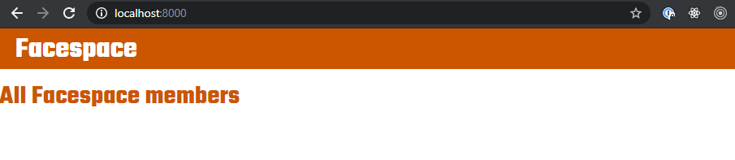
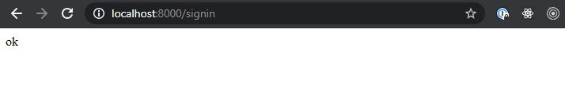

# Facespace!

## Goal

To create a site that will serve up Facespace! Oh, and learn a little more about Node, routing, EJS, and CSS along the way.

## Setup

- `yarn install`
- `yarn dev` to launch the server.

### About the Data

There is a file `/data/users.js` that contains an array of `user`s. Each user looks like this.

```js
{
  _id: '1008',
  name: 'Fletcher',
  friends: ['1006', '1007', '1009'], // array of the ids of user's friends
  avatarUrl: '/images/profile-pics/000003.jpg',
},
```

---

## The Workshop

### Exercise 1 - The Homepage

The homepage should show a grid of all of the users in the system.

#### 1.1 Create the homepage endpoint

Create a `GET` endpoint for the homepage. Update your server.js file to match this.

```diff
  'use strict';

  const express = require('express');
  const morgan = require('morgan');

  const { users } = require('./data/users');

  // declare the 404 function
  const handleFourOhFour = (req, res) => {
    res.status(404).send("I couldn't find what you're looking for.");
  };

+ const handleHomepage = (req, res) => {
+   res.status(200).send('homepage');
+ };

  // -----------------------------------------------------
  // server endpoints
  express()
    .use(morgan('dev'))
    .use(express.static('public'))
    .use(express.urlencoded({ extended: false }))
    .set('view engine', 'ejs')

    // endpoints
+  .get('/', handleHomepage)

    // a catchall endpoint that will send the 404 message.
    .get('*', handleFourOhFour)

    .listen(8000, () => console.log('Listening on port 8000'));
```

Once you've added this right code, load the homepage at [http://localhost:8000](http://localhost:8000). You should see this.


#### 1.2 Create the `homepage.ejs` template

- In `views/pages/` there is a file called `homepage.ejs`
- Add this code to that file.

```html
<!-- note that all of our page templates will include a header and footer partial -->
<%- include('../partials/header') %>
<div class="home-page">
  <h2>All Facespace members</h2>
  <!-- content here -->
</div>
<%- include('../partials/footer') %>
```

#### 1.3 Render the homepage

To render the homepage, you will need to modify the `handleHomepage` function. Instead of `send`ing something. Let's render the `homepage.ejs` file that we just created.

```diff
  const handleHomepage = (req, res) => {
-   res.status(200).send('homepage');
+   res.status(200).render('pages/homepage');
  };
```

You should now see this in the browser:



#### 1.4 Render all of the users

First we need to pass the users data to the `ejs` template. When rendering an `ejs` template, we can pass it an object as the second argument that can contain anything we like. In this case, we want to pass the entire `users` array.

```js
res.status(200).render('pages/homepage', { users: users });
```

Once the data is available to the template, we need to loop through the array and render all of the images.

```html
<ul class="homepage__all">
  <% users.forEach(user => { %>
  <li class="homepage__all--user">
    " />
  </li>
  <% }) %>
</ul>
```

You should now see this in the browser:


---

### Exercise 2 - The Profile Page

Let's create a profile page that will be unique to each user. Our endpoint should contain the user's `_id`, which will allow us to "know" which data to use.

#### 2.1 Create a users endpoint

Create a `GET` endpoint that we can use to show the user's profile page. Your endpoint should start with `/users/` and end with a url param for the `_id`.

This endpoint will trigger a function `handleProfilePage` that you will need to create as well. For now, have that function `res.send` the `_id` that is in the url.


#### 2.2 Create the Profile Page and render it

In `/views/page/`, create a file called `profile.ejs`. This will be the page that we render, at the endpoint we created above.

Here is the beginning of the code, you will need for this file.

```html
<%- include('../partials/header') %>
<div class="profile-page">
  <%= user.name %>
</div>
<%- include('../partials/footer') %>
```

Convert the `res.send` you have in `handleProfilePage` to a `res.render` of that profile page.

Notice the temporary insertion of the `user.name` into the ejs template. You can use that to confirm that your endpoint is functioning properly. Currently, it should not be working. We need to send the user data to the `ejs` template.

Add the user's data to that object. You will need to figure out which user data to send based on the provided `_id` in the url params.

```js
res.status(200).res.render('pages/profile/', { user: 🤔 });
```

#### 2.3 Render all of the user's data to the page.

- Render the user's avatar, and name.

```html
<div>
  " alt="<% user.name %>" />
  <h2><%= user.name %></h2>
</div>
```

- 💎 Render the list of friends.

```html
<div>
  <h3><%= user.name %>'s Friends</h3>
  <ul>
    <!-- use .forEach to loop over the array of friends -->
    <!-- each friend's image and name should be visible. -->
    <!-- User's image should link to their profile page. -->
  </ul>
</div>
```

#### 2.4 Create the HTML and CSS for the Profile page

Below is what the profile page should look like. While it doesn't need to be pixel-perfect, it should be close enough as to _not_ look different from the images below. I've provided the mobile version as well.

A good breakpoint for the mobile to desktop in this case is `600px`.

<div style="display:flex;">
  
  
</div>

1. The banner should be a background image and not an HTML element.
2. The user's name is an `h2`.

---

### Exercise 3 - The Sign in page

Our security system will be total crap, but will work for our purposes. True site security is too important for us to implement ourselves! When the time comes, we'll leverage code from experts in the field.

For this workshop, we're going to simply ask for the user's first name and if it's in the users array, we'll assume that that is the person that is logging in.

#### 3.1 Create the endpoint

In `server.js` we need to have an endpoint that will receive requests for the signin page. This endpoint will call a function called `handleSignin`.

Here is the server file. Add the `/signin` endpoint and `handleSignin` function.

```diff
  'use strict';

  const express = require('express');
  const morgan = require('morgan');

  const { users } = require('./data/users');

  // declare the 404 function
  const handleFourOhFour = (req, res) => {
    res.status(404).send("I couldn't find what you're looking for.");
  };

+ const handleSignin = (req, res) => {
+   res.status(200).send('ok');
+ };

  // -----------------------------------------------------
  // server endpoints
  express()
    .use(morgan('dev'))
    .use(express.static('public'))
    .use(express.urlencoded({ extended: false }))
    .set('view engine', 'ejs')

    // endpoints
+  .get('/signin', handleSignin)

    // a catchall endpoint that will send the 404 message.
    .get('*', handleFourOhFour)

    .listen(8000, () => console.log('Listening on port 8000'));
```

This will allow us to "see" what is on the signin page... Nothing.



#### 3.2 Create the form

In `views/pages`, create a new file called `signin.ejs`. Add the following `ejs` code to the file. Take a few minutes to go over this code and make sure you understand what it's doing.

```html
<%- include('../partials/header') %>
<div class="signin-page">
  <form method="get" action="/getname" class="signin-page__form">
    <label for="firstName" class="signin-page__form--label">First name</label>
    <input
      type="text"
      name="firstName"
      placeholder="Your first name"
      class="signin-page__form--input"
    />
    <button type="submit" class="signin-page__form--button">Submit</button>
  </form>
</div>
<%- include('../partials/footer') %>
```

#### 3.3 Render the signin page.

The form we've just added doesn't yet render on the `/signin` page. We need to tell `handleSign` to render that particular `ejs` page template.

```diff
  const handleSignin = (req, res) => {
-   res.status(200).send('ok');
+   res.status(200).render('pages/signin');
  };
```


#### 3.4 Receive the data from the form

Our form looks good but it doesn't yet do anything. We need the form to send the input to the server.

Notice that the form (in `signin.ejs`) has `action` attribute. That is the endpoint that the form will contact when a user submits the form. Let's create a `GET` endpoint that will receive the data from the form.

```js
.get('/getname', handleName)
```

Notice that the endpoint is calling a new function. We need to define that function above. _You can define it right after the `handleSignin` function._

```js
const handleName = (req, res) => {};
```

This type of HTML form sends the data from the form as query parameters in the `req`uest.

1. Define a variable `firstName` and assign the value of `req.query.firstName`. You can also write a temporary `console.log()` to make sure that your function works and that you have access to the value of `firstName`.
2. Use the `firstName` to `find()` that user's data in `users.js`. That array is already imported and available to you. (See line 6 of `server.js`).
3. If it exists assign it to the `currentUser` variable that is defined on line 8, and then redirect to the homepage.
4. If it doesn't exist, redirect to the signin page.

We can redirect the browser to an endpoint with the following code.

```js
res.redirect('/the-endpoint');
```

5. You should also return a status code to the browser.

```js
res.status(200); // when the request is successful
res.status(404); // when the request is not successful. In this case, the user was not found.
```

It is good practice to chain our status and our render like so:

```js
res.status(404).render('/signin');
```

We'll come back to the signin functionality after we create the profile page.

---

#### x.x Redirect to the user's profile page

Rather than redirect to the homepage, like so: `res.status(200).redirect('/');`. Let's write a dynamic endpoint that grabs the user's `_id` and puts it in the endpoint. This endpoint should match the endpoint you just created in 2.1.

At this point, we have a working signin page that will redirect to the homepage on a successful signin. Our app won't actually have a homepage. The budget is tight and it was deemed unnecessary for the launch.
