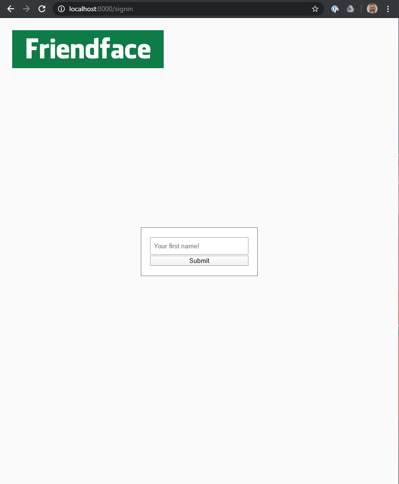

# Friendface!


## What is Friendface?

On one episode of the IT Crowd, they start using a new app that completely takes over their lives.

[See an ad for Friendface here! 😂](https://www.youtube.com/watch?v=6rNgCnY1lPg)

There is an actual [Facebook page](https://www.facebook.com/pages/category/Product-Service/Friendface-54430568576/) dedicated Friendface. (There are probably more...)

I thought we could build our very own version of it. _Please code responsibly._

<br style='clear: both;'/>

## Goal

To create a site that will serve up Friendface! Oh, and learn a little more about Node, routing, EJS, and SASS along the way.

### MVP Functionality

- Users arrive at the homepage, and need to enter their name to "sign in."
- Access is granted if their name is found in the `users` array.
    - If the name entered is not recognized, it reloads the signin page.
- Once signed in, the homepage will show that user's Friendface page.
    - For now, the page will consist of the image of the user, as big and bold as yuor feel comfortable going.
    - A gallery of all of their friends.
    - Clicking on a friend's face, will take us to their Friendface page.

### Stretch Goals

- Ability to view all Faces that are not yet friends. (A button on the page labeled 'FFF' or 'Find Future Friends'.)
- Ability to add/remove friends faces.
- Adding/reomving a friend should also update the friend's page. _It may look like that is happening already but don't be fooled. It ain't!
- Ability reorder your Friends (upvote/downvote?)

## Limitations

### Data Persistence

Because we don't have and form of data storage, we cannot persist changes when the server reloads. 🤔 This could be a super stretch goal: implement "saving" with the `fs` module.

### Security

Our security system will be total crap, but will work for our purposes. True site security is too important for us to implement ourselves! When the time comes, we'll leverage code from experts in the field.

## Setup

- `yarn install`
- `yarn dev` to launch the server.

### Server Endpoints

Create the following endpoints

| Endpoint    | Description | 
| ----------- | ----------- |
| `/`         | home/main page |
| `/signin`   | signin page |
| `/user/:id` | user page |
| `/getname`  | this is the endpoint that will receive the data from the signinn form |
| `*`         | Don't forget to have a 404 page setup as well. |

### About the Data

There is `/data/users.js` file that contains an array of `user` objects. Everyone from the class is in there!

```js
{
    id: '1009',
    name: 'Sadnan',
    friends: ['1006', '1008', '1007'],
    avatarUrl: 'https://ca.slack-edge.com/T045DMA9Q-U614C2NSY-b7ff28d1b0b1-512' 
},
```

- Avatars are taken from Slack.
- `friends` is an array of the `id`s of the people user is currently friends with.
- In an effort, to start with _good_ data, I have created friendships for all of you. It was random, and purely based on placement in the array. I took groups of 4, or 3 for the last group, and made all of you friends. 

### Notable Methods and Code Snippets

These are methods and bits of code that yuo will most likely need.

- `res.redirect()`
- `array.find()`

```html
<form method='get' action='/getname' class='signin-form'>
    <label for='firstName'>First name</label>
    <input type='text' name='firstName' />
    <button type='submit'>Submit</button>
</form>
```

This is the form code. We will soon find out why this is super weird, but it works with the tools that we have at the moment.

On submission, the value from the input field will be available in `req.query.firstName`.

#### The Road to Cleaner Code.

Up to now, we've been adding our route functions arguments directly inside get method. That makes for some messy code. It would be better to have our methods be short and easy to ready. For this project, declare your functions in the server file, above all of the route. _Routes should always be at the bottom of the file._

##### Example

```js
// declare the function
const handleFourOhFour = (req, res) => {
    res.status(404);
    res.render('pages/fourOhFour', {
        title: 'I got nothing',
        path: req.originalUrl
    });
}

// pass it to the method at the bottom of the file
app.get('*', handleFourOhFour);
```

## Screenshots




