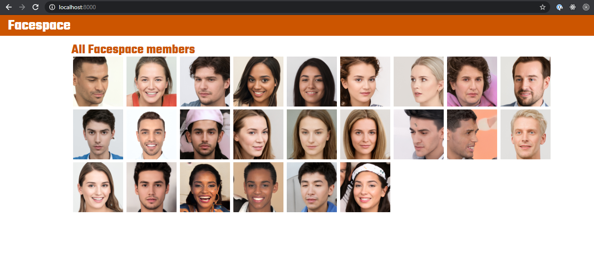
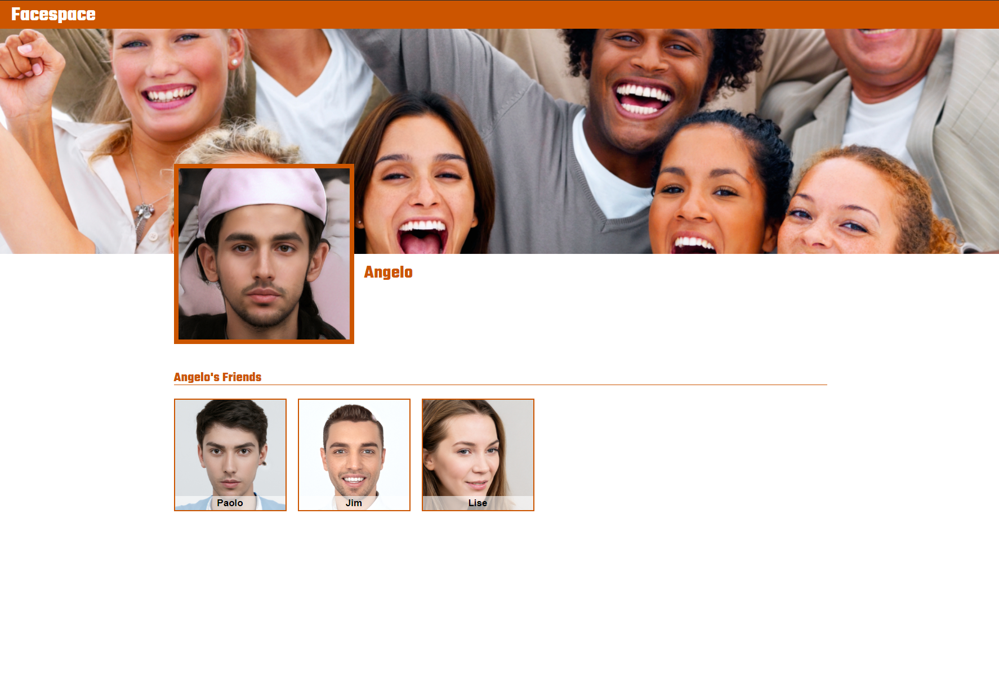
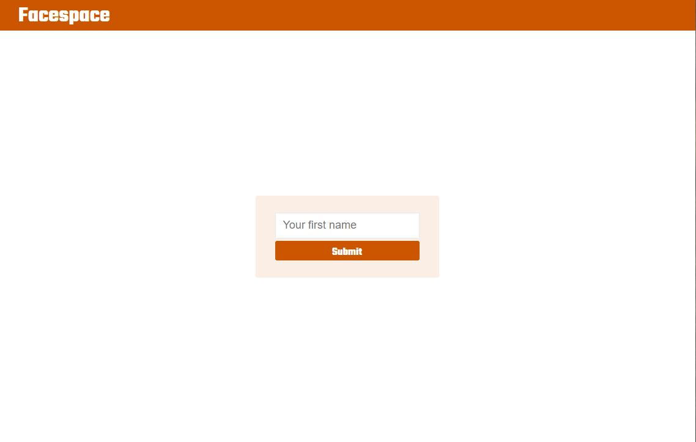
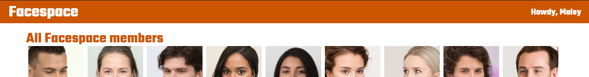
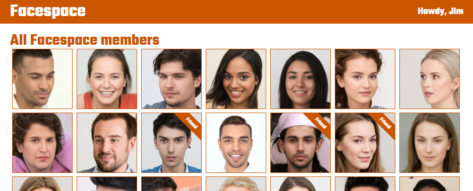

# Facespace!

## Goal

Create a site that will serve up Facespace! Oh, and learn a little more about Node, routing, React and CSS along the way.

## Setup

This repository contains a frontend and a backend folder. This means that each folder is contains a complete environment (`package.json`, `/node_modules`) and are completely independent. You cannot reference code from one environment in the other environment.

Generally speaking, the frontend will query the backend via calls to the server endpoints.

### File Structure

```
├── __lecture
├── backend
    ├── node_modules (where all external dependencies are saved)
    |   ├── ...
    |   └── ...
    ├── server.js
    └── yarn.lock ("locks" the dependency versions)
├── frontend
    ├── public
    ├── src
    ├── node_modules (where all external dependencies are saved)
    |   ├── ...
    |   └── ...
    ├── package.json (where we keep a record of the app setup)
    └── yarn.lock ("locks" the dependency versions)
├── .gitignore
├── .prettierrc
└── README.md (this file)
```

### The Frontend

1. Open a terminal in VS Code
2. Type `cd frontend`
3. Type `yarn install`

Use `yarn dev:frontend` to start the frontend dev environment.

### The Backend

1. Open _another_ terminal in VS Code
2. Type `cd backend`
3. Type `yarn install`

Use `yarn dev:backend` to start the backend dev environment.

## About the Data

There is a file `/data/users.js` that contains an array of `user`s. Each user looks like this.

```js
{
  _id: '1008',
  name: 'Fletcher',
  friends: ['1006', '1007', '1009'], // array of the ids of user's friends
  avatarUrl: '/images/profile-pics/000003.jpg',
},
```

## Screenshots

### Homepage



### The Profile Page



### The Sign in page



### A link to the signin page in the header

We should have a link to the signin page in the header.


When the user is signed in, the "sign in" link should be replaced by a greeting and the user's name.



While you're in the header, it would be good to turn the title into a link to the homepage.

### Faces on the homepage

- Faces on the homepage should link to that person's profile page.
- Let's also add a little UX tweak on hover. Give the image some sort of effect on hover.


### My Friends!

When a user is signed in and looking at the homepage, it would be great if there were some visual indication as to who their friends are in the grid of faces. My example is a ribbon on the image, but feel free to do whatever you like.



### No Sign in for you!

If someone is already signed in, they should not be able to see the signin page. Prevent this from happening.

### Stretch Goals

Here are some other features that you could add to the app. _None of these have any solutions._

- User can add/remove friends. _This should update the friends array of both users. Being friends is reciprocal._
- If a user adds a friend, they are not automatically added. The other user needs to accept this first. _It would be useful to create a new array of `pendingFriends` in the user object._
- A sign up page... that does exactly what you would expect.
- Don't like the orange theme, change it. Flex your CSS muscles!!
- What else can you think of?
